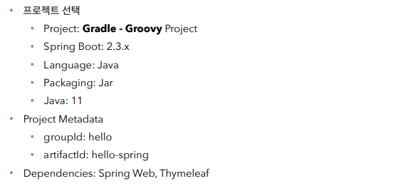
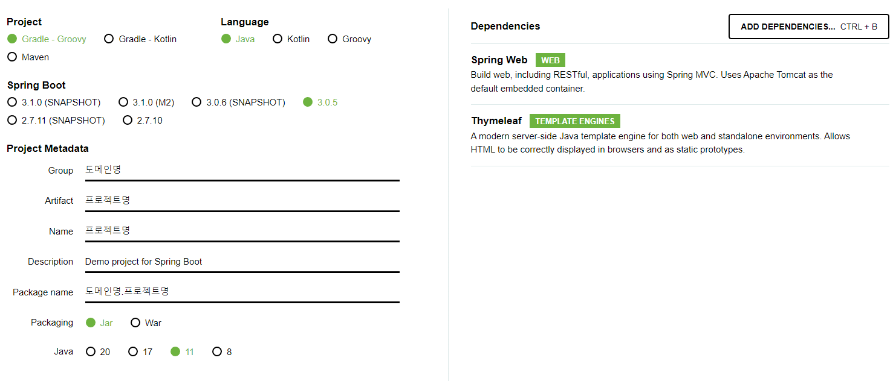
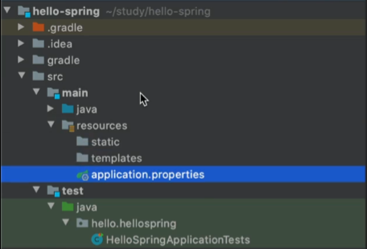
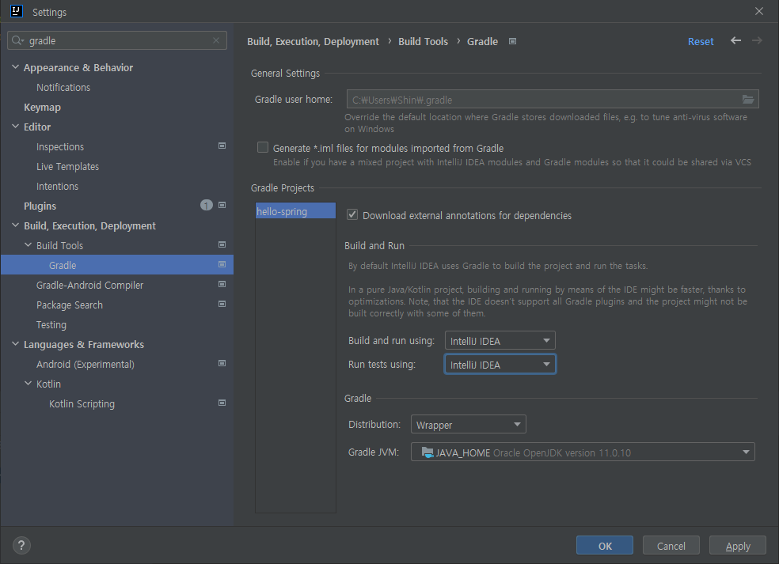
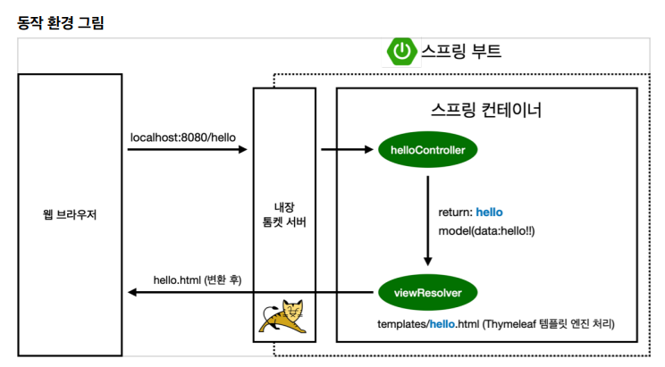
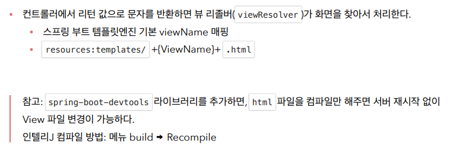
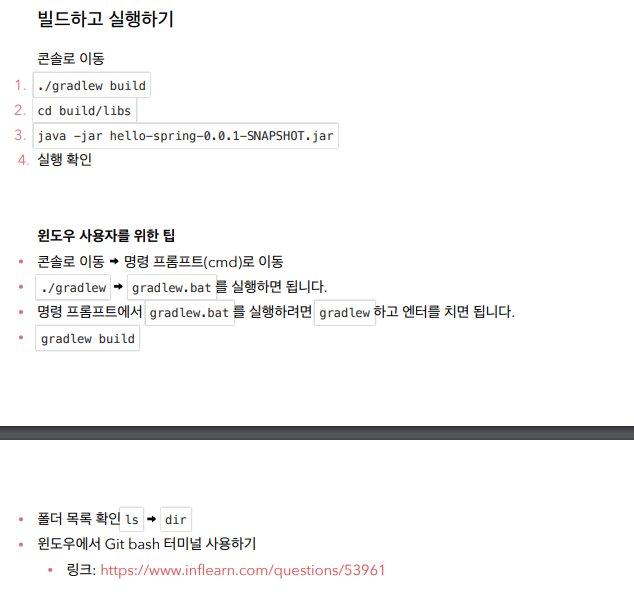

# S1 프로젝트 환경 설정

---

---

# 1. 프로젝트 생성

### project 생성하기

프로젝트 생성 사이트 : [start.spring.io](https://start.spring.io/)

- 필요한 라이브러리를 가져오고 라이프 사이클을 관리
    - maven
    - gradle





프로젝트 다운로드 후 - Open - 폴더 내 build.gradle 열기



resources : 자바 코드를 제외한 xml, 설정 파일이 들어감 

### 프로젝트 세팅

- gradle을 통해서 실행되는 것을 방지하고 인텔리제이에서 자바를 바로 실행하도록 세팅



---

# 2. 라이브러리 살펴보기

### 스프링 부트 라이브러리

- spring-boot-starter-web
    - spring-boot-starter-tomcat
    - spring-webmvc
- spring-boot-starter-thymeleaf : 타임리프 템플릿 엔진 (view)
- spring-boot-starter(공통) :  스피링 부트   스프링 코어   로깅
    - spring-boot-starter-logging
        - logback, slf4j
    - spring-boot
        - spring-core
- spring-boot-starter-test
    - junit : 테스트 프레임워크
    - mockito : 목 라이브러리
    - assertj : 테스트 코드 작성 보조 라이브러리
    - spring-test

---

# 3. View 환경설정

### Welcome 페이지 만들지

- resources의 static → templates 순으로 index.html을 찾음

<html xmlns:th="[http://www.thymeleaf.org](http://www.thymeleaf.org/)">

- 위 문장을 넣으면 타임리프 문법을 html에서 사용할 수 있음

```java
@Controller
public class HelloController {
    @GetMapping("hello")
    public String hello(Model model) {
        model.addAttribute("data", "hello!!");
        return "hello";
    }
}
```

```
resources/templates/hello.html

<!DOCTYPE HTML>
<html xmlns:th="<http://www.thymeleaf.org>">
<head>
  <title>Hello</title>
  <meta http-equiv="Content-Type" content="text/html; charset=UTF-8" />
</head>
<body>
  <p th:text="'안녕하세요. '   ${data}" >안녕하세요. 손님</p>
</body>
</html>

```

### 스프링 동작 순서





---

# 4. 빌드하고 실행하기



1) 프로젝트 루트 경로 이동

2) gardlew build 진행 (./를 붙여야하는 경우와 그냥 하는 경우 둘 다 테스트)

3) cd build/libs

4) java -jar hello-spring-0.0.1-SNAPSHOT.jar

---