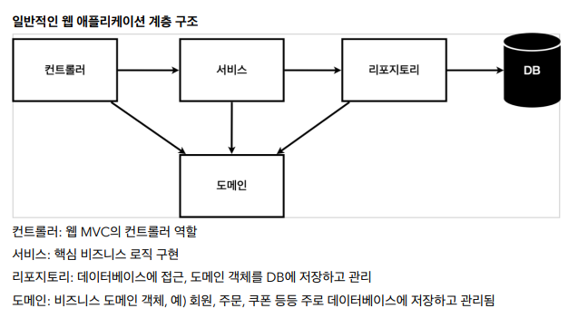
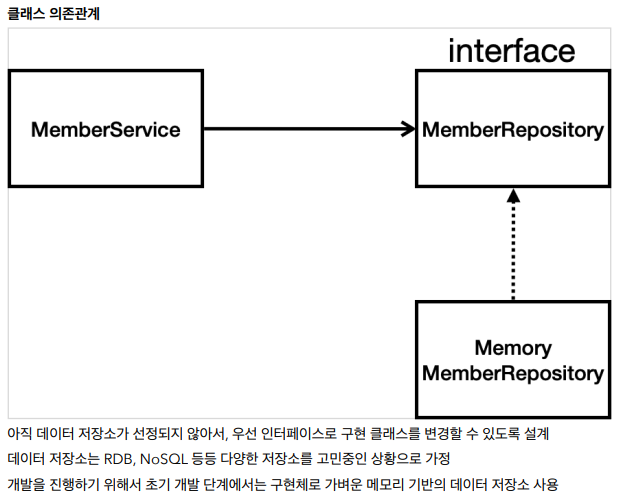

# S3 회원 관리 예제

---

---

# 1. 비즈니스 요구사항 정리





---

# 2. 회원 도메인과 리포지토리 만들기

null이 나올 가능성이 있으면 Optional로 감싸서 반환 → null이 에러가 뜨지 않음

```java
// domain/Member.java

private Long id;
private String name;

// getter and setter
```

```java
// repository/MemberRepository.java

public interface MemberRepository {
    Member save(Member member);
    Optional<Member> findById(Long id);
    Optional<Member> findById(String name);
    List<Member> findAll();
}
```

```java
// repository/MemoryMemberRepository.java

public class MemoryMemberRepository implements MemberRepository {
    private static Map<Long, Member> store = new HashMap<>();
= 0L;

    @Override
    public Member save(Member member) {
        member.setId(  sequence);
        store.put(member.getId(), member);
        return member;
    }

    @Override
    public Optional<Member> findById(Long id) {
        return Optional.ofNullable(store.get(id));
    }

    @Override
    public Optional<Member> findById(String name) {
        return store.values().stream().filter(member -> member.getName().equals(name)).findAny();
    }

    @Override
    public List<Member> findAll() {
        return new ArrayList<>(store.values());
    }
}
```

---

# 3. 회원 리포지토리 테스트 케이스 작성

- JUnit을 통한 테스트 케이스 테스트

```java
// MemoryMemberRepositoryTest

public class MemoryMemberRepositoryTest {
    MemoryMemberRepository repository = new MemoryMemberRepository();
    
    @Test
    public void save() {
        Member member = new Member();
        member.setName("spring");

        repository.save(member);

        Member result = repository.findById(member.getId()).get();

        // 1. 출력으로 확인하기
        // System.out.println("result = "   (result == member));

        // 2. jupiter Assertions 로 확인하기
        // import org.junit.jupiter.api.Assertions
        // Assertions.assertEquals(member, result); // 값이 같은지 다른지 테스트

        // 3.assertj Assertions 로 확인하기
        //pi.Assertions.*;
        assertThat(member).isEqualTo(result);

    }

    @Test
    public void findByName() {
        Member member1 = new Member();
        member1.setName("spring1");
        repository.save(member1);

        Member member2 = new Member();
        member2.setName("spring2");
        repository.save(member2);

        Member result = repository.findByName("spring1").get(); // OK
        // Member result = repository.findByName("spring2").get(); // Error

        assertThat(result).isEqualTo(member1);
    }

    @Test
    public void findAll() {
        Member member1 = new Member();
        member1.setName("spring1");
        repository.save(member1);

        Member member2 = new Member();
        member2.setName("spring2");
        repository.save(member2);

        List<Member> result = repository.findAll();

        assertThat(result.size()).isEqualTo(2);

    }

}
```

- 테스트는 순서가 보장되지 않음
    - 각 테스트는 의존 관계가 있도록 만들면 안됨
    - 테스트가 끝날 때마다 데이터를 지워줘야 함

```java
// MemoryMemberRepositoryTest

@AfterEach // 단위 테스트가 하나 끝날때마다 실행됨
public void afterEach() {
    repository.clearStore(); // 테스트가 필요한 repo마다 직접 적절히 구현해야 함
}
```

TDD : 테스트 틀을 먼저 만들고 구현을 하는 것

---

# 4. 회원 서비스 개발

JUnit으로 테스트 코드를 만들어서 실행함

---

# 5. 회원 서비스 테스트

테스트는 일반적으로 아래와 같은 방식으로 구현하면 됨

```java
// given (기반 데이터)
주어졌을 때

// when (검증)
이걸 실행하면

// then (결과)
나오는 결과
```

```java
class MemberServiceTest {

    MemberService memberService;
    MemoryMemberRepository memberRepository;

    @BeforeEach
    public void beforeEach() {
        memberRepository = new MemoryMemberRepository();
        memberService = new MemberService(memberRepository);
    }

    @AfterEach
    public void afterEach() {
        memberRepository.clearStore();
    }

    @Test
    void join() {
        // given
        Member member = new Member();
        member.setName("hello");

        // when
        Long saveId = memberService.join(member);

        // then
        Member findMember = memberService.findOne(saveId).get();
        assertThat(member.getName()).isEqualTo(findMember.getName());
    }

    @Test
    public void 중복회원예외() {
        // given
        Member member1 = new Member();
        member1.setName("spring");

        Member member2 = new Member();
        member2.setName("spring");

        // when
        // try-catch 대신 이걸 쓰자
        memberService.join(member1);
        IllegalStateException e = assertThrows(IllegalStateException.class, () -> memberService.join(member2));// 생각한 예외와 동일한 것이 뜨는지

        assertThat(e.getMessage()).isEqualTo("이미 존재하는 회원입니다");

        // then
    }
}
```