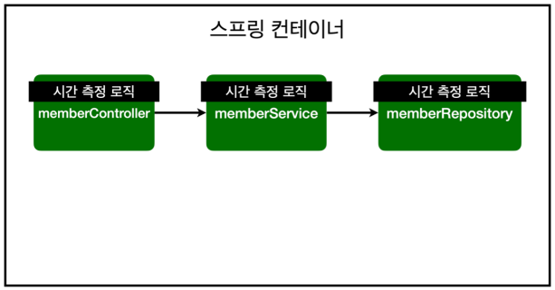
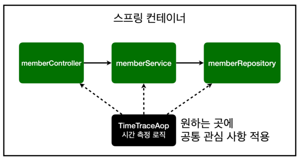
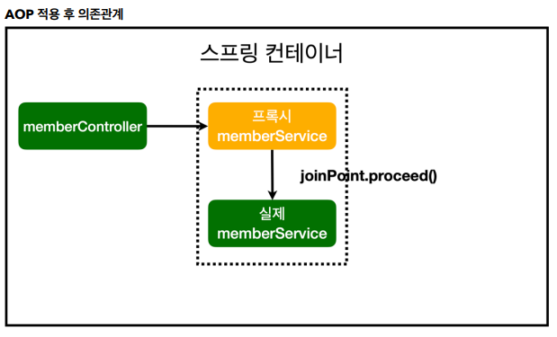
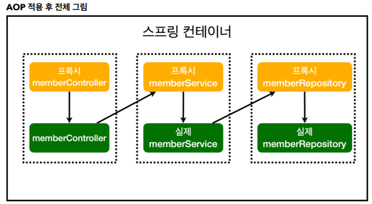

# S7 AOP

---

---

# 1. AOP가 필요한 상황

상황

- 모든 메소드의 호출 시간을 측정하고 싶다면?
- 공통 관심 사항(cross-cutting concern) vs 핵심 관심 사항(core concern)
- 회원 가입 시간, 회원 조회 시간을 측정하고 싶다면?

단순 코딩 시 문제점



- 시간 측정 기능은 핵심 관심 사항이 아님
- 모든 기능에 공통으로 들어가는 공통 관심 사항
- 공통 관심사항과 핵심 관심 사항 코드가 섞여서 유지보수가 어려울 수 있음
- 일부 코드가 바뀌면 공통 관심 사항을 적용한 모든 코드를 찾아가 수정해야 함

---

# 2. AOP 적용



- AOP: Aspect Oriented Programming
- 공통 관심 사항(cross-cutting concern) vs 핵심 관심 사항(core concern) 분리

`TimeTraceAop.java`

```java
@Aspect
@Component
public class TimeTraceAop {

    // 적용 범위를 지정함 (현재 : 하위 패키지에 있는 모든 파일에 적용하겠다)
    @Around("execution(* hello.hellospring..*(..))")
    public Object execute(ProceedingJoinPoint joinPoint) throws Throwable {
        long start = System.currentTimeMillis();
        System.out.println("Start: "   joinPoint.toString());

        try {
            return joinPoint.proceed();
        } finally {
            long finish = System.currentTimeMillis();
            long timeMs = finish - start;
            System.out.println("END: "   joinPoint.toString()   " "   timeMs   "ms" );

        }
    }
}
```



가짜인 프록시 스프링 빈을 생성하고 프로시드가 타고 나서 실제 스프링 빈을 호출

